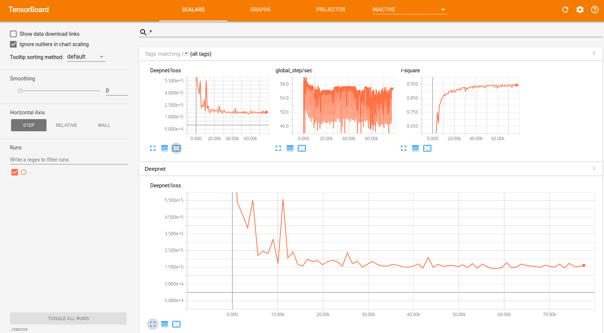

.. _demo_desc:

Demos
=====

We have included some demonstration scripts with Aboleth to help you get
familiar with some of the possible model architectures that can be build with
Aboleth. We also demonstrate in these scripts a few methods for actually
training models using TensorFlow, and how to get up and running with
TensorBoard, etc. 

.. _regress:

Regression
----------

This is a simple demo that draws a random, non linear function from a Gaussian
process with a specified kernel and length scale. We then use Aboleth (in
Gaussian process approximation mode) to try to learn this function given only a
few noisy observations of it. This script also demonstrates how we can divide
the data into mini-batches using utilities in the `tf.contrib.data
<https://www.tensorflow.org/programmers_guide/datasets>`_ module, and how we
can use `tf.train.MonitoredTrainingSession
<https://www.tensorflow.org/api_docs/python/tf/train/MonitoredTrainingSession>`_
to log the learning progress.   

This demo can be used to generate figures like the following:

.. figure:: GP_approx.png

You can find the full script here: `regression.py
<https://github.com/data61/aboleth/blob/develop/demos/regression.py>`_.
    

.. _sarcos_reg:

SARCOS
------

Here we use Aboleth, again in Gaussian process regression mode, to fit the
venerable `SARCOS <http://www.gaussianprocess.org/gpml/data/>`_ robot arm
inverse kinematics dataset. The aim is to learn the inverse kinematics from
44484 observations of joint positions, velocities and accelerations to joint
torques.

This problem is too large for a regular Gaussian process, and so is a good
demonstration of why the approximation in Aboleth is useful (see :ref:`gp`). It
also demonstrates how we learn automatic relevance determination (ARD, or
anisotropic) kernels.

We have also demonstrated how you can use `TensorBoard
<https://www.tensorflow.org/get_started/summaries_and_tensorboard>`_ with the
models you construct in Aboleth, so you can visually monitor the progress of
learning. This also allows us to visualise the model's performance on the
*validation* set every training epoch. Using TensorBoard has the nice
side-effect of also enabling model check point saving, so you can actually
*resume* learning this model if you run the script *again*!!

    Using TensorBoard to visualise the learning progress of the Aboleth model
    fitting the SARCOS dataset. The "r-square" plot here is made from
    evaluating the R-square performance on the held-out test set every epoch of
    training.

This demo will make a ``sarcos`` folder in the directory you run the demo from.
This contains all of the model checkpoints, and to visualise these with
TensorBoard, run the following::

    $ tensorboard --logdir=./sarcos

The full script is here: `sarcos.py
<https://github.com/data61/aboleth/blob/develop/demos/sarcos.py>`_.

.. _multi_in:

Multiple Input Data
-------------------

This demo takes inspiration from TensorFlow's `Wide & Deep
<https://www.tensorflow.org/tutorials/wide_and_deep>`_ tutorial in that it
treats continuous data separately from categorical data, though we combine both
input types into a "deep" network. It also uses the census dataset from the
TensorFlow tutorial.

We demonstrate a few things in this script:

- How to use Aboleth to learn embeddings of categorical data using the
  ``ab.EmbedVariational`` layer (see :ref:`layers`).
- How to easily apply these embeddings over multiple columns using the
  ``ab.PerFeature`` higher-order layer (see :ref:`hlayers`).
- Concatenating these input layers (using ``ab.Concat``) before feeding them
  into subsequent layers to learn joint representations.
- How to loop over mini-batches directly using a ``feed_dict`` and an
  appropriate mini-batch generator, ``ab.batch`` (see :ref:`util`).

Using this set up we get an accuracy of about 85.3%, compared to the wide and
deep model that achieves 84.4%.

The full script is here: `multi_input.py
<https://github.com/data61/aboleth/blob/develop/demos/multi_input.py>`_.

.. _clas_drop:

Bayesian Classification with Dropout
------------------------------------

Here we demonstrate a slightly different take on Bayesian deep learning. Yarin
Gal in his `thesis <http://mlg.eng.cam.ac.uk/yarin/blog_2248.html>`_ and
associate publications demonstrates that we can view regular neural networks
with dropout as a form of variational inference with specific prior and
posterior distributions on the weights.

In this demo we implement this elegant idea with maximum a-posteriori weight
and dropout layers in a classifier (see :ref:`layers`). We leave these layers
as stochastic in the prediction step, and draw samples from the network's
predictive distribution, as we would in variational networks.

We test the classifier against a random forest classifier on the `breast cancer
dataset
<http://archive.ics.uci.edu/ml/datasets/breast+cancer+wisconsin+%28diagnostic%29>`_
with 5-fold cross validation, and get quite good and robust performance.

The script can be found here: `classification.py
<https://github.com/data61/aboleth/blob/develop/demos/classification.py>`_

.. _impute_layers:

Imputation Layers
-----------------

Aboleth has a few layers that we can use to *impute* data and also to *learn
imputation statistics*, see :ref:`impute`. This drastically simplifies the
pipeline for dealing with messy data, and means our imputation methods can
benefit from information contained in the labels (as opposed to imputing as a
separate stage from supervised learning).

This script demonstrates an imputation layer that learns a "mean" and a
"standard deviation" of a Normal distribution (per column) to *randomly* impute
the data from! We compare it to just imputing the missing values with the
column means.

The task is a multi-task classification problem in which we have to predict
forest coverage types from 54 features or various types, described `here
<http://archive.ics.uci.edu/ml/datasets/Covertype>`_. We have randomly removed
elements from the features, which we impute using the two aforementioned
techniques.

Naive mean imputation gives 68.7% accuracy (0.717 log loss), and the per-column
Normal imputation gives 69.1% accuracy (0.713 log loss). 

You can find the script here: `imputation.py
<https://github.com/data61/aboleth/blob/develop/demos/imputation.py>`_

