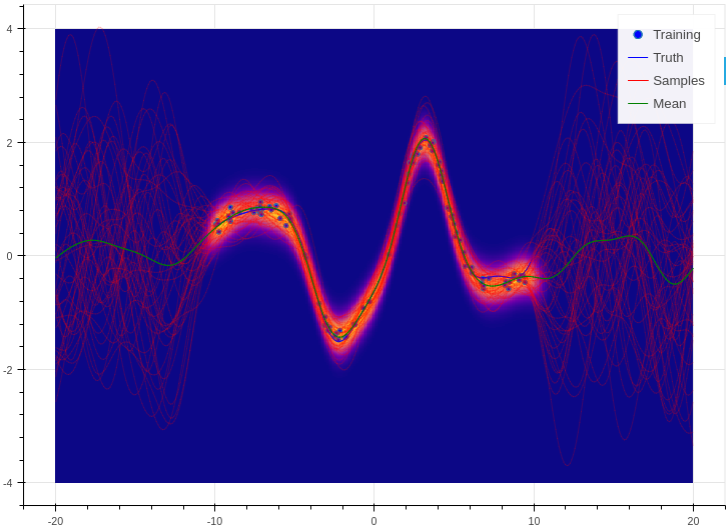

.. _quickstart:

Quick Start Guide
=================

In Aboleth we use function composition to compose machine learning models.
These models are callable python classes that when called return a TensorFlow
computational graph (really a ``tf.Tensor``). We can best demonstrate this with
a few examples.

.. _log_clas:

Logistic Classification
-----------------------

For our first example, lets make a simple logistic classifier with :math:`L_2`
regularisation on the model weights:

.. code::

    import tensorflow as tf
    import aboleth as ab

    layers = (
        ab.InputLayer(name="X") >>
        ab.DenseMap(output_dim=1, l1_reg=0, l2_reg=.05) >>
        ab.Activation(tf.nn.sigmoid)
    )

Here the right shift operator, ``>>``, implements functions composition (or
specifically, a writer monad) from the innermost function to the outermost.
The above code block has has implemented the following function,

.. math::

    p(\mathbf{y} = 1 | \mathbf{X}) = \sigma(\mathbf{X}\mathbf{w}),

where :math:`\mathbf{w} \in \mathbb{R}^D` are the model weights,
:math:`\mathbf{y} \in \mathbb{N}^N_2` are the binary labels, :math:`\mathbf{X}
\in \mathbb{R}^{N \times D}` are the predictive inputs and
:math:`\sigma(\cdot)` is a logistic sigmoid function. At this stage ``layers``
is a callable class (``ab.baselayers.MultiLayerComposite``), and no
computational graph has been built.  ``ab.InputLayer`` allows us to name our
inputs so we can refer to them later when we call our class ``layers``. This is
useful when we have multiple inputs into our model, for examples, if we want to
deal with continuous and categorical features separately (see :ref:`multi_in`).

So now we have defined the structure of the predictive model, if we wish we can
create its computational graph,

.. code::

    net, reg = layers(X=X_)

where the keyword argument ``X`` was defined in the ``InputLayer`` and ``X_``
is a placeholder (``tf.placeholder``) or the actual predictive data we want to
build into our model. ``net`` is the resulting computational graph of our
predictive model/network, and ``reg`` are the regularisation terms associated
with the model parameters (layer weights in this case).

If we wanted, we could evaluate ``net`` right now in a TensorFlow session,
however none of the weights have been fit to the data. In order to fit the
weights, we need to define a loss function. For this we need to define a
likelihood model for our classifier, here we choose a Bernoulli distribution
for our binary classifier (which corresponds to a log-loss):

.. code::
        
    likelihood = tf.distributions.Bernoulli(probs=net)

If we were to call ``likelihood.log_prob(Y)``, it would return a tensor that
implements the log of a Bernoulli probability mass function,

.. math::

    \mathcal{L}(y_n, p_n) = y_n \log p_n + (1 - y_n) \log(1 - p_n).

which is an integral part of our loss function. Here we have used :math:`p_n`
as shorthand for :math:`p(y_n = 1)`. 

.. note::
    We actually find it is more numerically stable to define Bernoulli
    likelihoods with logits::

        likelihood = tf.distributions.Bernoulli(logits=net)

    Where::

        layers = (
            ab.InputLayer(name="X") >>
            ab.DenseMap(output_dim=1, l1_reg=0, l2_reg=.05) >>
        )
        net, reg = layers(X=X_)

    The ``Bernoulli`` class then computes the sigmoid activation internally.

Now we have enough to build the loss function we will use to optimize the model
weights:

.. code::
        
    loss = ab.max_posterior(net, Y_, reg, likelihood)

This is a *maximum a-posteriori* loss function, which can be thought of as a 
maximum likelihood objective with a penalty on the magnitude of the weights
from a Gaussian prior (controlled by ``l2_reg`` or :math:`\lambda`),

.. math::

    \min_{\mathbf{w}} - \frac{1}{N} \sum_n \mathcal{L}(y_n,
    \sigma(\mathbf{x}_n^\top \mathbf{w})) +
    \frac{\lambda}{2}\|\mathbf{w}\|^2_2.

Now we have enough to use the ``tf.train`` module to learn the weights of our
model:

.. code::

    optimizer = tf.train.AdamOptimizer()
    train = optimizer.minimize(loss)

    with tf.Session() as sess:
        tf.global_variables_initializer().run()

        for _ in range(1000):
            sess.run(train, feed_dict={X_: X, Y_: Y})

This will run 1000 iterations of stochastic gradient optimization (using the
Adam learning rate algorithm) where the model sees all of the data every
iteration. We can also run this on mini-batches, see ``ab.batch`` for a simple
batch generator, or TensorFlow's `train` module for a more comprehensive set of
utilities (we recommend looking at 
`tf.train.MonitoredTrainingSession
<https://www.tensorflow.org/api_docs/python/tf/train/MonitoredTrainingSession>`_, 
`tf.train.limit_epochs
<https://www.tensorflow.org/api_docs/python/tf/train/limit_epochs>`_ and 
`tf.train.shuffle_batch
<https://www.tensorflow.org/api_docs/python/tf/train/shuffle_batch>`_).

Now that we have learned our classifier's weights, :math:`\hat{\mathbf{w}}`, we
will probably want to use for predicting class label probabilities on unseen
data :math:`\mathbf{x}^*`,

.. math::

    p(y^* = 1 | \mathbf{X}, \mathbf{x}^*) = 
        \sigma(\mathbf{x}^{* \top}\hat{\mathbf{w}}).

This can be very easily achieved by just evaluating our model on the unseen
predictive data (still in the TensorFlow session from above):

.. code::

    probs = net.eval(feed_dict={X_: X_query})

.. note::
    If you used logits as per the above note, then the prediction becomes::
        
        probs = likelihood.probs.eval(feed_dict={X_: X_query})

And that is it!

.. _bayes_log_clas:

Bayesian Logistic Classification
--------------------------------

Aboleth is all about Bayesian inference, so now we'll demonstrate how to make a
variational inference version of the logistic classifier. Now we explicitly
place a prior distribution on the weights,

.. math::

    p(\mathbf{w}) = \mathcal{N}(\mathbf{w} | \mathbf{0}, \psi^2 \mathbf{I}_D).

Here :math:`\psi` is the prior weight standard deviation (note that this
corresponds to :math:`\sqrt{\lambda^{-1}}` in the MAP logistic classifier).
We use the same likelihood model as before,

.. math::

    p(y_n | \mathbf{w}, \mathbf{x}_n) = \text{Bernoulli}(y_n |
        \sigma(\mathbf{x}_n^\top \mathbf{w})),

and ideally we would like to infer the posterior distribution over these 
weights using Bayes' rule (as opposed to just the MAP value,
:math:`\hat{\mathbf{w}}`),

.. math::

    p(\mathbf{w} | \mathbf{X}, \mathbf{y}) = \frac{
    p(\mathbf{w}) \prod_n p(y_n | \mathbf{w}, \mathbf{x}_n)
    }{
    \int p(\mathbf{w}) \prod_n p(y_n | \mathbf{w}, \mathbf{x}_n) d\mathbf{w} 
    }.

Unfortunately the integral in the denominator is intractable for this model.
This is where variational inference comes to the rescue by approximating the
posterior with a known form -- in this case a Gaussian,

.. math::

    p(\mathbf{w} | \mathbf{X}, \mathbf{y}) & \approx q(\mathbf{w}), \\
        &= \mathcal{N}(\mathbf{w} | \boldsymbol{\mu}, \boldsymbol{\Sigma}),

where :math:`\boldsymbol{\mu} \in \mathbb{R}^D` and :math:`\boldsymbol{\Sigma}
\in \mathbb{R}^{D \times D}`. To make this approximation as close as possible,
variational inference optimizes the Kullback Leibler divergence between this
and true posterior using the evidence lower bound, ELBO, and the
reparameterization trick in [1]_:

.. math::

    \min_{\boldsymbol{\mu}, \boldsymbol{\Sigma}} \text{KL}\left[
        q(\mathbf{w}) \|
        p(\mathbf{w} | \mathbf{X}, \mathbf{y})
        \right].

One question you may ask is why would we want to go to all this bother over the
MAP approach? Specifically, why learn an extra :math:`\mathcal{O}(D^2)` number
of parameters over the MAP approach? Well, a few reasons, the first being that
the weights are well regularised in this formulation, for instance we can
actually learn :math:`\psi`, rather than having to set it (this optimization of
the prior is called empirical Bayes). Secondly, we have a principled way of
incorporating modelling uncertainty over the weights into our predictions,

.. math::

    p(y^* = 1 | \mathbf{X}, \mathbf{x}^*) &= \int
        \sigma(\mathbf{x}^{* \top}\mathbf{w})
        q(\mathbf{w}) d\mathbf{w}, \\
        &\approx \frac{1}{S} \sum^S_{s=1} 
        \sigma(\mathbf{x}^{* \top}\mathbf{w}^{(s)}),
        \quad \mathbf{w}^{(s)} \sim q(\mathbf{w}).

This will have the effect of making our predictive probabilities closer to 0.5
when the model is uncertain. The MAP approach has no mechanism to achieve this
since it only learns the mode of the posterior, :math:`\hat{\mathbf{w}}`, with
no notion of variance.

So how do we implement this with Aboleth? Easy; we change ``layers`` to the
following,

.. code::

    import numpy as np
    import tensorflow as tf
    import aboleth as ab

    layers = (
        ab.InputLayer(name="X", n_samples=5) >>
        ab.DenseVariational(output_dim=1, std=1., full=True) >>
        ab.Activation(tf.nn.sigmoid)
    )

Note we are using ``DenseVariational`` instead of ``DenseMAP``. In the
``DenseVariational`` layer the ``full`` parameter tells the layer to use a full
covariance Gaussian, and ``std`` is initial value of the weight prior standard
deviation, :math:`\psi`, which is optimized. Also we've set ``n_samples=5`` in
the ``InputLayer``, this lets the subsequent layers know that we are making a
*stochastic* model, that is, whenever we call ``layers`` we are actually
expecting back 5 samples of the model output. This makes the
``DenseVariational`` layer multiply its input with 5 samples of the weights
from the approximate posterior, :math:`\mathbf{X}\mathbf{w}^{(s)}`, where
:math:`\mathbf{w}^{(s)} \sim q(\mathbf{w}),~\text{for}~s = \{1 \ldots 5\}`.
These 5 samples are then passed to the ``Activation`` layer.

Then like before to complete the model specification:

.. code::

    net, kl = layers(X=X_)
    likelihood = tf.distributions.Bernoulli(probs=net)
    loss = ab.elbo(likelihood, Y_, N=10000, KL=kl)

The main differences here are that ``reg`` is now ``kl``, and we use the
``elbo`` loss function. For all intents and purposes ``kl`` is still a
regularizer on the weights (it is the Kullback Leibler divergence between the
posterior and the prior distributions on the weights), and ``elbo`` is the
evidence lower bound objective. Here ``N`` is the (expected) size of the
dataset, we need to know this term in order to properly calculate the evidence
lower bound when using mini-batches of data.

We train this model in exactly the same way as the logistic classifier, however
prediction is slightly different - that is, ``probs``,

.. code::

    probs = net.eval(feed_dict={X_: X_query})

now has a shape of :math:`(5, N^*, 1)` where we have 5 samples of :math:`N^*`
predictions; before we had :math:`(N^*, 1)`. You can simply take the mean of
these samples for the predicted class probability,

.. code::

    expected_p = np.mean(probs, axis=0)

or, you can generate *more* samples to get a more accurate expected
probabilities (again with the TensorFlow session, ``sess``),

.. code::

    probabilities = ab.predict_samples(net, feed_dict={X_: X_query},
                                       n_groups=10, session=sess)

This effectively calls ``net`` 10 times (``n_groups``) and concatenates the
results into 50 samples (``n_groups * n_samples``), then we can take the mean
of these samples exactly as before.

.. _gp:

Approximate Gaussian Processes
------------------------------

Aboleth also provides the building blocks to easily create scalable
(approximate) Gaussian processes. We'll implement a simple Gaussian process
regressor here, but for brevity, we'll skip the introduction to Gaussian
processes, and refer the interested reader to [2]_. 

The approximation we have implemented in Aboleth is the *random feature
expansions* (see [3]_ and [4]_), where we can approximate a kernel function
from a set of random basis functions,

.. math::

    \text{k}(\mathbf{x}_i, \mathbf{x}_j) \approx \frac{1}{S}
        \sum^S_{s=1} \phi^{(s)}(\mathbf{x}_i)^\top \phi^{(s)}(\mathbf{x}_j),

with equality in the infinite limit. The trick is to find the right family of
basis functions, :math:`\phi`, that corresponds to a particular family of
kernel functions, e.g. radial basis, Matern, etc. This insight allows us to
approximate a Gaussian process regressor with a *Bayesian linear regressor*
using these random basis functions, :math:`\phi^{(s)}(\mathbf{X})`!

We can easily do this using Aboleth, for example, with a radial basis kernel,

.. code::

    import tensorflow as tf
    import aboleth as ab
    
    lenscale = tf.Variable(1.)  # learn isotropic length scale
    kern = ab.RBF(lenscale=ab.pos(lenscale))

    layers = (
        ab.InputLayer(name="X", n_samples=5) >>
        ab.RandomFourier(n_features=100, kernel=kern) >>
        ab.DenseVariational(output_dim=1, full=True)
    )

Here we have made ``lenscale`` a TensorFlow variable so it will be optimized,
and we have also used the ``ab.pos`` function to make sure it stays positive.
The ``ab.RandomFourier`` class implements random Fourier features [3]_, that
can model shift invariant kernel functions like radial basis, Matern, etc. See
:ref:`kernels` for implemented kernels. We have also implemented random
arc-cosine kernels [4]_ see ``ab.RandomArcCosine`` in :ref:`layers`.

Then to complete the formulation of the Gaussian process (likelihood and loss),

.. code::

    std = tf.Variable(1.)  # learn likelihood std. deviation

    net, kl = layers(X=X_)
    likelihood = tf.distributions.Normal(net, scale=ab.pos(std))
    loss = ab.elbo(likelihood, Y_, kl, N=10000)

Here we just have a Normal likelihood since we are creating a model for
regression, and we can also get TensorFlow to optimise the likelihood standard
deviation, ``std``.

Training and prediction work in exactly the same way as the Bayesian logistic
classifier. Here is an example of the approximate GP in action (see
:ref:`regress` for a more detailed demonstration);

    Example of an approximate Gaussian process with a radial basis kernel. We
    have shown 50 samples of the predicted latent functions, the mean of these
    draws, and the heatmap is the probability of observing a target under the
    predictive distribution, :math:`p(y^*|\mathbf{X}, \mathbf{y},
    \mathbf{x}^*)`.
    

See Also
--------

For more detailed demonstrations of the functionality within Aboleth, we
recommend you check out the demos,

- :ref:`regress` and :ref:`sarcos_reg` - for more regression applications. 
- :ref:`multi_in` - models with multiple input data types.
- :ref:`clas_drop` - Bayesian nets using dropout.
- :ref:`impute_layers` - let Aboleth deal with missing data for you.

References
----------

.. [1] Kingma, D. P. and Welling, M. Auto-encoding variational Bayes. In ICLR,
       2014.
.. [2] Rasmussen, C. E., and Williams, C. K. I. Gaussian processes for machine
       learning. Cambridge: MIT press, 2006.
.. [3] Rahimi, A., & Recht, B. Random features for large-scale kernel machines.
       Advances in neural information processing systems. 2007.
.. [4] Cutajar, K. Bonilla, E. Michiardi, P. Filippone, M. Random Feature 
       Expansions for Deep Gaussian Processes. In ICML, 2017.
