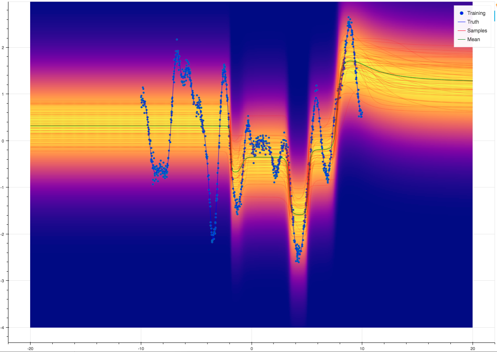

.. _tut_keras:

Integrating Aboleth with Keras
==============================

In most circumstances, Aboleth's layer composition framework is interoperable 
with TensorFlow and Keras layers. This gives us access to a vast range of 
layers not directly implemented in Aboleth which are suitable for various 
problems, such as LSTMs, GRUs and other variants of recurrent layers for 
sequence prediction, to name just one example. Furthermore, this also allows 
us to readily take advantage of the various sophisticated normalization and 
activation layers proposed in the current research, such as 
Batch Normalization [#]_, Leaky ReLU, ELU [#]_, et cetera.

Here we define a simple wrapper layer that allows one to plug in Keras / 
TensorFlow layers.

.. code:: python

   class WrapperLayer(SampleLayer):

       def __init__(self, layer, *args, **kwargs):

           self.layer = layer(*args, **kwargs)

       def _build(self, X):
           """Build the graph of this layer."""

           # keras first flattens the `n - len(input_shape)` dimensions 
           # of the array and operates on last `len(input_shape)` dimensions
           # which has shape `input_shape`
           Net = self.layer(X)
           # aggregate layer regularization terms
           KL = tf.reduce_sum(self.layer.losses)

           return Net, KL

Now we can use the wrapped layers and Aboleth's native layers interchangeably.
For example, consider tackling a toy regression problem using a deep neural net 
with dropout layers, where we perform maximum a posteriori (MAP) estimation of 
the layer weights / biases. The following are effectively equivalent:

.. code:: python

   net = (
      ab.InputLayer(name="X", n_samples=n_samples_) >>
      ab.DenseMAP(output_dim=64, l2_reg=0.01, l1_reg=0.) >>
      ab.Activation(tf.tanh) >>
      ab.DropOut(keep_prob=.5) >>
      ab.DenseMAP(output_dim=64, l2_reg=0.01, l1_reg=0.) >>
      ab.Activation(tf.tanh) >>
      ab.DropOut(keep_prob=.5) >>
      ab.DenseMAP(output_dim=1, l2_reg=0.01, l1_reg=0.)
   )

.. code:: python

   l1_l2_reg = tf.keras.regularizers.l1_l2(l1=0., l2=0.01)   

   net = (
      ab.InputLayer(name="X", n_samples=n_samples_) >>
      WrapperLayer(tf.keras.layers.Dense, units=64, activation='tanh',
                   kernel_regularizer=l1_l2_reg, bias_regularizer=l1_l2_reg) >>
      ab.DropOut(keep_prob=.5) >>
      WrapperLayer(tf.keras.layers.Dense, units=64, activation='tanh',
                   kernel_regularizer=l1_l2_reg, bias_regularizer=l1_l2_reg) >>
      ab.DropOut(keep_prob=.5) >>
      WrapperLayer(tf.keras.layers.Dense, units=1, kernel_regularizer=l1_l2_reg,
                   bias_regularizer=l1_l2_reg)
   )

Now it's easy to augment this model by incorporating other building blocks from 
Keras, e.g.

.. code:: python

   net = (
      ab.InputLayer(name="X", n_samples=n_samples_) >>
      WrapperLayer(tf.keras.layers.Dense, units=64) >>
      WrapperLayer(tf.keras.layers.BatchNormalization) >>
      WrapperLayer(tf.keras.layers.LeakyReLU) >>
      ab.DropOut(keep_prob=.5) >>

      WrapperLayer(tf.keras.layers.Dense, units=64) >>
      WrapperLayer(tf.keras.layers.BatchNormalization) >>
      WrapperLayer(tf.keras.layers.LeakyReLU) >>
      ab.DropOut(keep_prob=.5) >>

      WrapperLayer(tf.keras.layers.Dense, units=1, kernel_regularizer=l1_l2_reg,
                   bias_regularizer=l1_l2_reg)
   )

Or use it to perform classification on sequences:

.. code:: python

   net = (
      ab.InputLayer(name="X", n_samples=n_samples_) >>
      WrapperLayer(tf.keras.layers.LSTM, units=128) >>
      ab.DropOut(keep_prob=.5) >>
      WrapperLayer(tf.keras.layers.Dense, units=1)
   )

You can find the script here: `regression_keras.py
<https://github.com/data61/aboleth/blob/develop/demos/regression_keras.py>`_

.. [#] S. Ioffe and C. Szegedy, 
   "Batch Normalization: Accelerating Deep Network Training by Reducing 
   Internal Covariate Shift," in Proceedings of the 32nd International 
   Conference on Machine Learning, 2015, vol. 37, pp. 448–456.
.. [#] D.-A. Clevert, T. Unterthiner, and S. Hochreiter, 
   Fast and Accurate Deep Network Learning by Exponential Linear Units (ELUs)," 
   Nov. 2015.
