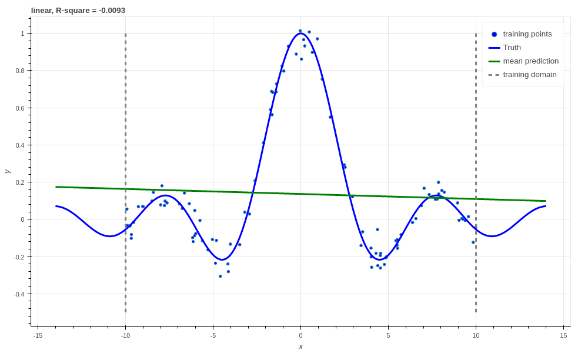

.. _tut_regress:

A regression masterclass with Aboleth
=====================================

In this tutorial we will show you how to build a variety of linear and non
linear regressors with the building blocks in Aboleth - and demonstrate how
easy it is once you have the basics down!

We'll start off with with some linear regressors, in particular:

- Simple linear regression/ridge regression
- Bayesian linear regression

Then we'll show you how to extend these models to:

- Neural net regression
- Neural net regression with dropout
- Bayesian neural net regression
- Approximate support vector regression
- Gaussian process regression
- Deep Gaussian process regression

All of these are built using the same framework! You can find the code used to
generate this tutorial in the `demos
<https://github.com/data61/aboleth/blob/develop/demos/>`_ folder in Aboleth.

Data

Training examples

Predict latent function

Extrapolation

R-square

Simple linear regression
------------------------

    Simple linear regression, R-square :math:`\approx 0`.

Bayesian linear regression
--------------------------

.. figure:: regression_figs/bayesian_linear.png

    Bayesian linear regression, R-square :math:`\approx 0`.

Gaussian process
----------------

.. figure:: regression_figs/gpr.png

    Gaussian process regression, R-square = 0.9974.
