.. _tut_regress:

A Regression Masterclass with Aboleth
=====================================

In this tutorial we will show you how to build a variety of linear and non
linear regressors with the building blocks in Aboleth - and demonstrate how
easy it is once you have the basics down!

We'll start off with with some linear regressors, then we'll extend these 
models to various types of neural networks. We'll also talk about how we can
approximate other types of non linear regressors with Aboleth, such as support
vector regressors and Gaussian processes.

Firstly, for the purposes of this tutorial we have generated 100 noisy samples 
from the non-linear function,

.. math::

    y_i = \frac{\sin(x_i)}{x_i} + \epsilon_i,

where we draw :math:`\epsilon_i \sim \mathcal{N}(0, 0.05)`. We will use this
data to fit the regressors, with the aim of getting them to reconstruct the 
latent function,

.. math::
    f = \frac{\sin(x)}{x},

with as little error as possible. This is what this data set looks like:

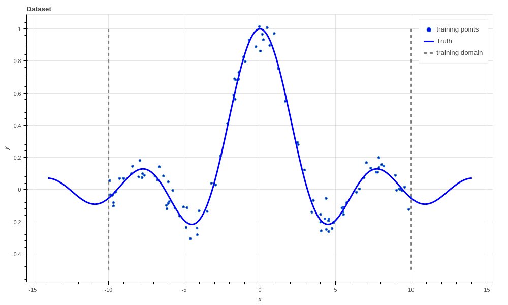

    The dataset used for fitting the regressors. There are 100 noisy training
    points (blue dots) that the algorithms get to see, and 1000 noise free
    points (blue line) that the algorithm has to predict.

We use :math:`R^2`, AKA the `coefficient of determination
<https://en.wikipedia.org/wiki/Coefficient_of_determination>`_ to evaluate how
good the estimate of the latent functions is. An :math:`R^2` of 1.0 is a
perfect fit, and 0.0 means no better than a Normal distribution fit only to the
targets, :math:`y_i`.

Note in the figure above that we have only generated training data for
:math:`x` from -10 to 10, but we evaluate the algorithms from -14 to 14! This
is because we want to see how well the algorithms extrapolate away from the
data, which is a very hard problem. We don't evaluate the :math:`R^2` in this
extrapolation region since it makes it harder to differentiate the performance
of the algorithms in the bounds of the training data. However, it is
interesting to see how the algorithms represent their uncertainty (or don't) in
this region.

Linear regression
-----------------

The easiest algorithms to build with Aboleth are linear regressors, and so this
is where we'll start this tutorial. Specifically, we'll start with ridge
regression that has the following objective (or "loss") function,

.. math::
    \min_{w, b} \frac{1}{2N} \sum_{i=1}^N \|w x_i + b - y_i\|^2_2
    + \frac{\lambda}{2} \left( \|w\|^2_2 + \|b\|^2_2 \right),

where :math:`w` and :math:`b` are the regression weights and bias, and
:math:`\lambda` the regularization coefficient that penalises large magnitude
weights. This can be simply implemented in Aboleth using the following code,

.. code::

    lambda_ = 1e-4  # Weight regularizer
    noise = 1.  # Likelihood st. dev.

    net = (
        ab.InputLayer(name="X") >>
        ab.DenseMAP(output_dim=1, l2_reg=lambda_, l1_reg=0.)
    )

    Xw, reg = net(X=X)
    lkhood = tf.distributions.Normal(loc=Xw, scale=noise)
    loss = ab.max_posterior(lkhood, Y, reg) 

Here ``reg`` is the second regularizing term in the objective function, and
putting a ``Normal`` likelihood distribution with a standard deviation of 1.0,
gives us the first term (up to a constant value) when using ``max_posterior``.
Alternatively, if we didn't want to use a likelihood function we could have
constructed the ``loss`` as

.. code::

    loss = 0.5 * tf.reduce_mean((Y - Xw)**2) + reg

This is also called `maximum a-posteriori` inference. We can then give this
``loss`` tensor to a TensorFlow optimisation routine, such as the
``AdamOptimizer`` that we use in the `regression
<https://github.com/data61/aboleth/blob/develop/demos/regression.py>`_ demo. 

Naturally, this gives terrible results:

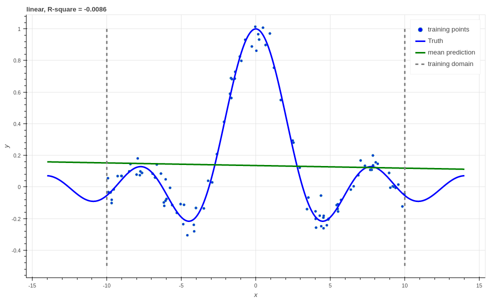

    Ridge linear regression, R-square :math:`\approx 0`.

Which we would expect from fitting a linear regressor to a non-linear function!
Just for illustrative purposes we'll now make a Bayesian linear regressor. We
shouldn't expect this to do any better than the ridge regressor since they have
equivalent predictive means. However, it is not really any harder to create
this regressor using Aboleth, and we can also easily obtain predictive
uncertainty from it.

In a Bayesian linear regressor (following [1]_) we model the observations as
being drawn from a Normal likelihood, and the weights from a Normal prior (we
have ignored the bias, :math:`b`, for simplicity),

.. math::

    y_i &\sim \mathcal{N}(w x_i, \sigma^2), \\
    w &\sim \mathcal{N}(0, \lambda^{-1})

where the aim is to estimate the parameters of the posterior distribution over
the weights (and optionally point estimates for :math:`\lambda, \sigma`),

.. math::

    w \sim \mathcal{N}(m, v).

The objective we use in this case is the `evidence lower bound` or `ELBO` as it
is easy to use with stochastic gradient descent for a variety of different
models [3]_. For Bayesian linear regression the ELBO takes the form,

.. math::

    \min_{m, v, \sigma, \lambda} - \sum_{i=1}^N 
        \mathbb{E}_{\mathcal{N}(w | m, v)}\!
        \left[ \log \mathcal{N}(y_i | w x_i, \sigma^2) \right]
        + \text{KL}\left[\mathcal{N}(w | m, v) \|
        \mathcal{N}(w | 0, \lambda^{-1})\right].

This looks complicated, but it's actually not too bad, especially when we
compare it to the ridge regression objective. Firstly, the expectation acts
like a data-fitting term (expected log likelihood of the targets given the
inputs and the weights), which corresponds to the l2 reconstruction term. Next,
the Kullback Leibler term (KL) is acting as a regulariser on the weights,
penalizing the posterior diverging from the prior. We can implement this model
with Aboleth using the following code,

.. code::

    lambda_ = 100.
    std = (1 / lambda_) ** .5  # Weight st. dev. prior
    noise = tf.Variable(1.)  # Likelihood st. dev. initialisation

    net = (
        ab.InputLayer(name="X", n_samples=n_samples) >>
        ab.DenseVariational(output_dim=1, std=std, full=True)
    )

    f, kl = net(X=X)
    lkhood = tf.distributions.Normal(loc=f, scale=ab.pos(noise))
    loss = ab.elbo(lkhood, Y, N, kl)

Note here that we have set ``n_samples`` to some value (e.g. 5) because the
``DenseVariational`` layer uses samples from its posterior distribution on the
weights for evaluation -- the more samples the smoother the estimates of the
model gradients.

Again, since we're using a linear model, we don't get great performance.

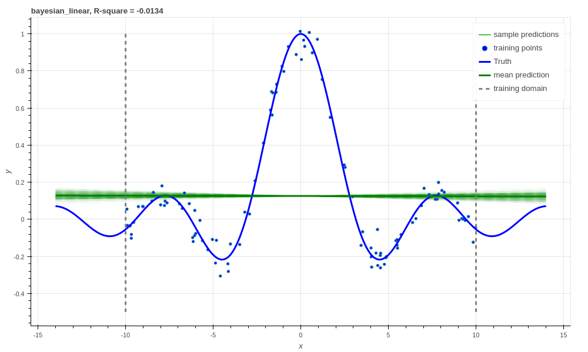

    Bayesian linear regression, R-square :math:`\approx 0`.

What's the point of going to all this effort implementing the ELBO over just
the ridge regression? Well a few reasons, firstly we can use this objective to
estimate the parameters :math:`\sigma~\&~\lambda` (this is called empirical
Bayes, see [2]_ Section 3.5 for a good explanation). Secondly, since we have a
posterior distribution over :math:`w`, we can get a distribution over
prediction of the latent functions, samples from which we can see in the above
figure. This tells us how confident out model is in its predictions. This will
come in handy later with some of the more complex models.

.. note::
    
    The model looks over-confident in its estimation of observations, however,
    we have only sampled the *latent function*. The value learned for the
    likelihood standard deviation, :math:`\sigma`, is quite large, and
    compensates for this small latent function variance.

    If we wanted to obtain predictive samples from our model over the
    `observations` instead of just the `latent function`, we would simply need
    to draw samples from our likelihood (e.g. ``lkhood.sample()``).

Ok, now lets move beyond building linear models with Aboleth.

Neural Networks
---------------

The first family of non-linear regressors we'll look at now are neural
networks, which classically have an objective something like,

.. math::
    \min_{w, b} \frac{1}{2N} \sum_{i=1}^N \|\text{NN}(x_i) - y_i\|^2_2
    + \sum_{l=1}^L
      \frac{\lambda_l}{2} \left( \|w_l\|^2_2 + \|b_l\|^2_2 \right).

Here :math:`\text{NN}` refers to the neural net function, which is a sequential
composition of linear layers (like our linear regressor) and non-linear
activation functions. We also have regularisers for each of the :math:`L`
linear layers.

In this tutorial we use 4 layers, and the code for constructing this model in
Aboleth is here:

.. code::

    lambda_ = 1e-4  # Weight regularizer
    noise = .5  # Likelihood st. dev.

    net = (
        ab.InputLayer(name="X", n_samples=1) >>
        ab.DenseMAP(output_dim=40, l2_reg=lambda_, l1_reg=0.) >>
        ab.Activation(tf.tanh) >>
        ab.DenseMAP(output_dim=20, l2_reg=lambda_, l1_reg=0.) >>
        ab.Activation(tf.tanh) >>
        ab.DenseMAP(output_dim=10, l2_reg=lambda_, l1_reg=0.) >>
        ab.Activation(tf.tanh) >>
        ab.DenseMAP(output_dim=1, l2_reg=lambda_, l1_reg=0.)
    )

    f, reg = net(X=X)
    lkhood = tf.distributions.Normal(loc=f, scale=noise)
    loss = ab.max_posterior(lkhood, Y, reg)

Where we have used hyperbolic tan activation functions. Now we get much better
performance on our regression task!

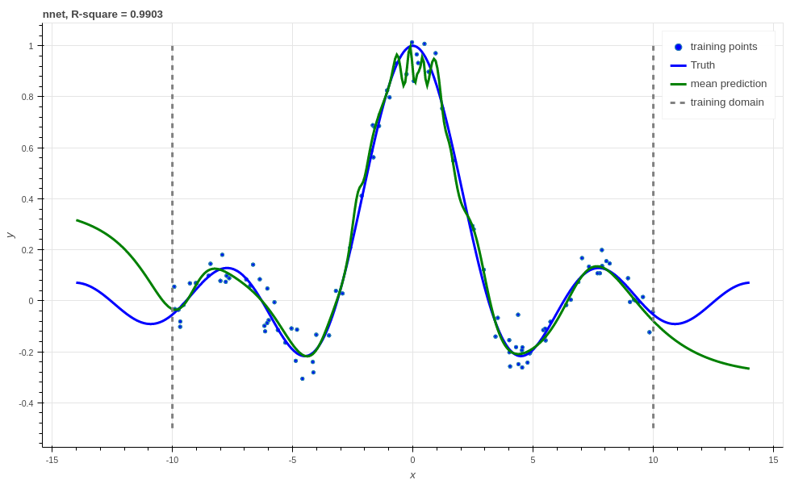

    Neural network with l2 regularization, R-square :math:`0.9903`.

There is a very easy trick to turn the above network into a Bayesian neural
net, courtesy of `Yarin Gal
<http://www.cs.ox.ac.uk/people/yarin.gal/website/blog_2248.html>`_ [4]_. All we
have to do is to add dropout to our network, and then keep dropout on during
prediction! We can optionally also sample the network more than once during
learning since the dropout makes it a stochastic network like our variational
layers.

.. code::

    lambda_ = 1e-3  # Weight prior
    noise = .5  # Likelihood st. dev.

    net = (
        ab.InputLayer(name="X", n_samples=n_samples_) >>
        ab.DenseMAP(output_dim=40, l2_reg=lambda_, l1_reg=0.) >>
        ab.Activation(tf.tanh) >>
        ab.DropOut(keep_prob=0.9) >>
        ab.DenseMAP(output_dim=20, l2_reg=lambda_, l1_reg=0.) >>
        ab.Activation(tf.tanh) >>
        ab.DropOut(keep_prob=0.95) >>
        ab.DenseMAP(output_dim=10, l2_reg=lambda_, l1_reg=0.) >>
        ab.Activation(tf.tanh) >>
        ab.DenseMAP(output_dim=1, l2_reg=lambda_, l1_reg=0.)
    )

    f, reg = net(X=X)
    lkhood = tf.distributions.Normal(loc=f, scale=noise)
    loss = ab.max_posterior(lkhood, Y, reg)

Now we get uncertainty on our latent functions:

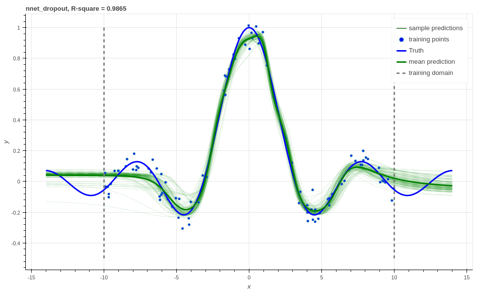

    Neural network with dropout, R-square :math:`0.9865`.

Though in this example we have a smoother prediction than the regular neural
network and have lost a bit of performance... this is something we could
potentially rectify with a bit more architecture tweaking (tuning the
regularisers per layer for example).

We can also use our ``DenseVariational`` layers with an `ELBO` objective to
create a Bayesian neural net. For brevity's sake we won't go into the exact
form of the objective, except to say that it parallels the conversion of the
linear regressor objective to the neural network objective. The code for
building the Bayesian neural net regressor is,

.. code::

    lambda_ = 1e-1  # Weight prior
    noise = tf.Variable(0.01)  # Likelihood st. dev. initialisation

    net = (
        ab.InputLayer(name="X", n_samples=n_samples_) >>
        ab.DenseVariational(output_dim=20, std=lambda_) >>
        ab.Activation(tf.nn.relu) >>
        ab.DenseVariational(output_dim=7, std=lambda_) >>
        ab.Activation(tf.nn.relu) >>
        ab.DenseVariational(output_dim=5, std=lambda_) >>
        ab.Activation(tf.tanh) >>
        ab.DenseVariational(output_dim=1, std=lambda_)
    )

    f, kl = net(X=X)
    lkhood = tf.distributions.Normal(loc=f, scale=ab.pos(noise))
    loss = ab.elbo(lkhood, Y, N, kl)

Unfortunately, this prediction is even smoother than the previous one. This
behaviour with Gaussian weight distributions is also something observed in
[4]_, and is likely because of the strong complexity penalty coming from the KL
regulariser.

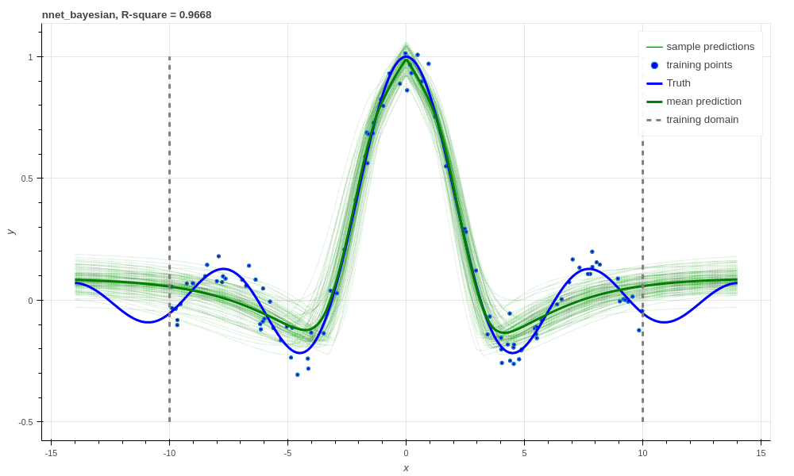

    Bayesian Neural network, R-square :math:`0.9668`.

If we train with more data, like in the figure below that uses 1000 training
points as opposed to 100, the KL term has less of an influence and we obtain a
good fit -- at least inside the range of the training data. This suggests that
with these types of Bayesian neural networks we need a lot of data to justify
fitting a complex function (or fewer parameters).

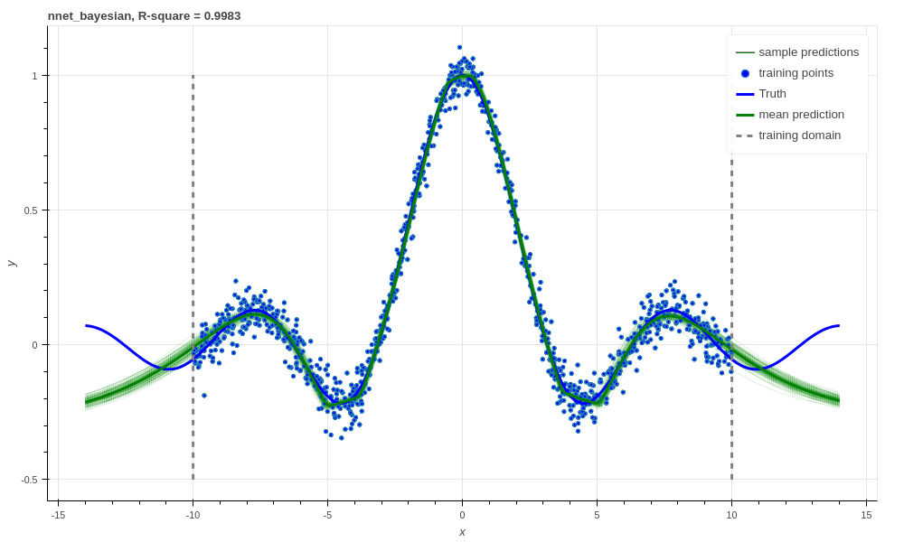

    Bayesian Neural network with 1000 training points, R-square :math:`0.9983`.

Support Vector-like Regression
------------------------------

We can also approximate a non linear `support vector regressor (SVR)
<https://en.wikipedia.org/wiki/Support_vector_machine#Regression>`_ with
Aboleth using the following objective,

.. math::
    \min_{w, b} \frac{1}{N} \sum_{i=1}^N 
    \max\left(|w \times \text{RFF}(x_i) + b - y_i - \epsilon|, 0\right)
    + \frac{\lambda}{2} \left( \|w\|^2_2 + \|b\|^2_2 \right),

Naturally we will be using stochastic gradients to solve this objective, and
not the original convex formulation. Also we are using random Fourier features
[5]_ to approximate the radial basis functions used in kernel support vector
machines. None-the-less, we would expect support vector regressor-like
behaviour! The code for this is as follows:

.. code::

    lambda_ = 1e-4
    eps = 0.01
    lenscale = 1.

    # Specify which kernel to approximate with the random Fourier features
    kern = ab.RBF(lenscale=lenscale)

    net = (
        ab.InputLayer(name="X", n_samples=1) >>
        ab.RandomFourier(n_features=50, kernel=kern) >>
        ab.DenseMAP(output_dim=1, l2_reg=lambda_, l1_reg=0.)
    )

    f, reg = net(X=X)
    loss = tf.reduce_mean(tf.nn.relu(tf.abs(Y - f - eps))) + reg

This results in the following prediction, which is the best we have achieved so
far (not including the 1000 training point Bayesian neural net). Though its
extrapolation performance leaves quite a lot to be desired.

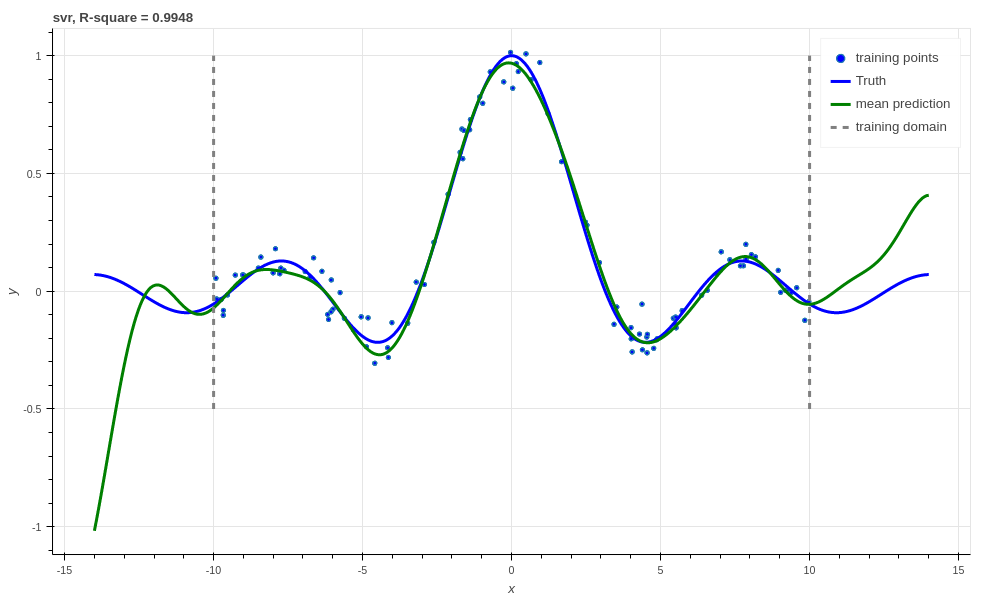

    Support vector regression, R-square :math:`0.9948`.

Interestingly, because Aboleth is just a set of "building blocks" we can employ
the same dropout trick that we used previously to make a "Bayesian" support
vector regressor. We just insert a ``DropOut`` layer after the
``RandomFourier`` layer in the code above and increase the number of samples,
this gives the following prediction.

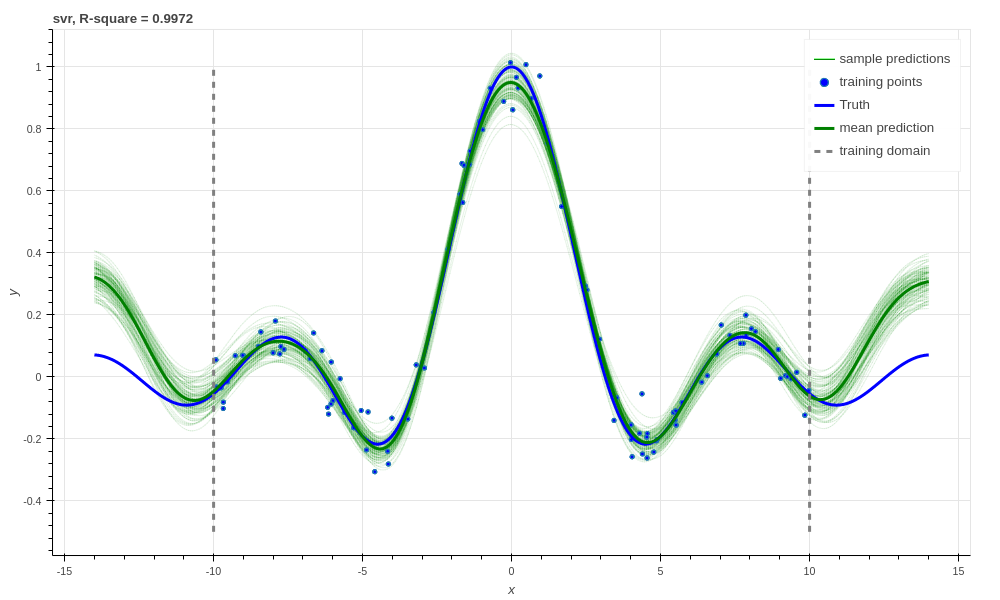

    Support vector regression with dropout, R-square :math:`0.9957`.

This is better than our last SVR prediction, and adding the dropout layer seems
to have somewhat controlled our extrapolation problem.

Gaussian process
----------------

The final class of non-linear regressors we will construct with Aboleth are
(approximate) Gaussian process (GP) regressors.

Typically Gaussian processes have a computational complexity of
:math:`\mathcal{O}(N^3)` in training where :math:`N` is the training set size.
This limits their application to fairly small problems. However, again using
random Fourier features [5]_, we can approximate them by slightly modifying the
Bayesian linear regressor from before,

.. code::

    lambda_ = 0.1  # Initial weight prior std. dev
    noise = tf.Variable(.5)  # Likelihood st. dev. initialisation
    lenscale = tf.Variable(1.)  # learn the length scale
    kern = ab.RBF(lenscale=ab.pos(lenscale))  # keep length scale +ve

    net = (
        ab.InputLayer(name="X", n_samples=n_samples_) >>
        ab.RandomFourier(n_features=50, kernel=kern) >>
        ab.DenseVariational(output_dim=1, std=lambda_, full=True)
    )

    f, kl = net(X=X)
    lkhood = tf.distributions.Normal(loc=f, scale=ab.pos(noise))
    loss = ab.elbo(lkhood, Y, N, kl)

Which makes these approximate GPs scale linearly with :math:`N` and allows us
to trivially use mini-batch stochastic gradient optimisation! The tradeoff is,
of course, how well they approximate GPs (in much the same way using random
Fourier features approximated SVRs before).

When we look at our prediction, we can see that we approximate a GP pretty
well, and we get the sensible extrapolation behaviour we would expect from a GP
too (falling back to zero away from the data in this case). Though, perhaps it
over-estimates the uncertainty in the latent function relative to a regular GP.
It also does better than the "Bayesian" SVR in terms of :math:`R^2`.

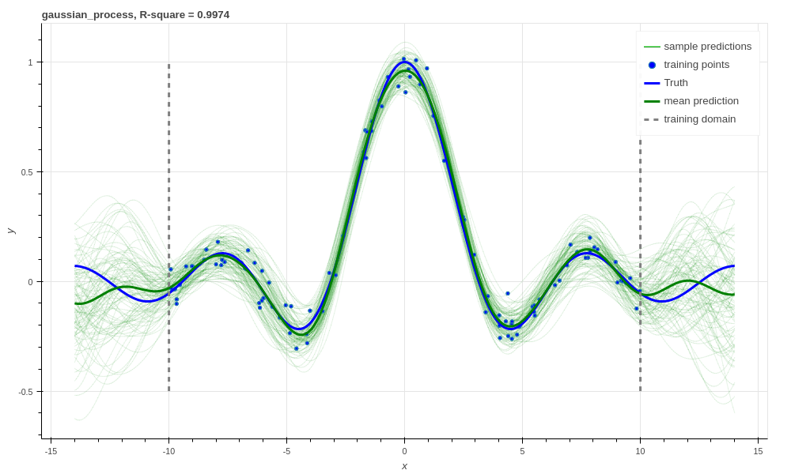

    Gaussian process regression, RBF kernel, R-square = 0.9974.

.. .. figure:: regression_figs/gpr_varrbf.png

..     Gaussian process regression, variational RBF kernel, R-square = 0.9941.

.. .. figure:: regression_figs/robust_gpr.png

..     Robust Gaussian process, RBF kernel, R-square = 0.9984.

We can also implement some of the recent Fourier feature Deep-GP algorithms
with Aboleth, such as those presented in [6]_:

.. code::

    lambda_ = 0.1  # Initial weight prior std. dev
    noise = tf.Variable(.01)  # Likelihood st. dev. initialisation
    lenscale = tf.Variable(1.)  # learn the first length scale only

    net = (
        ab.InputLayer(name="X", n_samples=n_samples_) >>
        ab.RandomFourier(n_features=20, kernel=ab.RBF(ab.pos(lenscale))) >>
        ab.DenseVariational(output_dim=5, std=lambda_, full=False) >>
        ab.RandomFourier(n_features=10, kernel=ab.RBF(1.)) >>
        ab.DenseVariational(output_dim=1, std=lambda_, full=False)
    )

    f, kl = net(X=X)
    lkhood = tf.distributions.Normal(loc=f, scale=ab.pos(noise))
    loss = ab.elbo(lkhood, Y, N, kl)

On such a simple problem we obtain similar performance to the regular GP,
though we see that extrapolation is worse, and is quite reminiscent of the
Neural network and SVR behaviour we were seeing previously. It would be
interesting to explore why this happens, and if it is a consequence of the
variational approximation, the random Fourier features, or just an inherent
property of Deep-GPs.

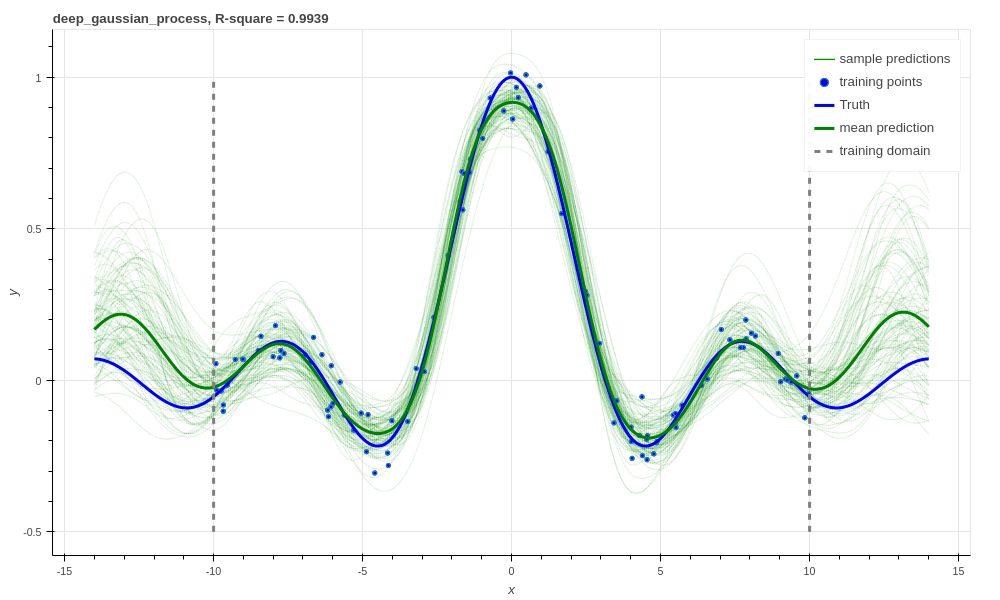

    Deep Gaussian process regression, RBF kernel, R-square = 0.9939.

And that is it! We hope this tutorial conveys just how flexible Aboleth is in
allowing you to construct different models. You can find the code used to
generate this figures and results in this tutorial with the demos `here
<https://github.com/data61/aboleth/blob/develop/demos/regression_tutorial.py>`_.

References
----------

.. [1] Rasmussen, C.E., and Williams, C.K.I. "Gaussian processes for machine
       learning." Vol. 1. Cambridge: MIT press, 2006.
.. [2] Bishop, C. M. "Pattern recognition and machine learning." Springer, 2006.
.. [3] Kingma, D. P. and Welling, M. "Auto-encoding variational Bayes." In
       ICLR, 2014.
.. [4] Gal, Yarin. "Uncertainty in deep learning." PhD thesis, University of 
       Cambridge, 2016.
.. [5] Rahimi, Ali, and Benjamin Recht. "Random features for large-scale kernel
       machines." In NIPS, 2007.
.. [6] Cutajar, K. Bonilla, E. Michiardi, P. Filippone, M. "Random Feature 
       Expansions for Deep Gaussian Processes." In ICML, 2017.
