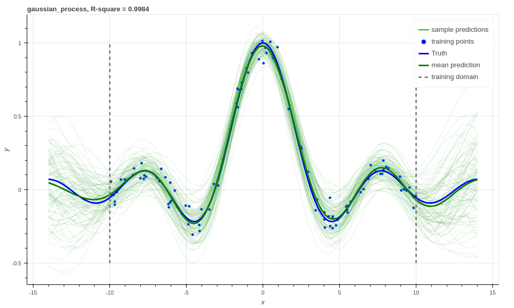

.. _tut_regress:

A regression masterclass with Aboleth
=====================================

In this tutorial we will show you how to build a variety of linear and non
linear regressors with the building blocks in Aboleth - and demonstrate how
easy it is once you have the basics down!

We'll start off with with some linear regressors, then we'll extend these 
models to various types of neural networks. We'll also talk about how we can
approximate other types of non linear regressors with Aboleth, such as support
vector regressors and Gaussian processes.

Firstly, for the purposes of this tutorial we have generated 100 noisy samples 
from the non-linear function,

.. math::

    y_i = \frac{\sin(x_i)}{x_i} + \epsilon_i,

where we draw :math:`\epsilon_i \sim \mathcal{N}(0, 0.05)`. We will use this
data to fit the regressors, with the aim of getting them to reconstruct the 
latent function,

.. math::
    f = \frac{\sin(x)}{x},

with as little error as possible. This is what this data set looks like:

.. figure:: regression_figs/data.png

    The dataset used for fitting the regressors. There are 100 noisy training
    points (blue dots) that the algorithms get to see, and 1000 noise free
    points (blue line) that the algorithm has to predict.

We use :math:`R^2`, AKA the `coefficient of determination
<https://en.wikipedia.org/wiki/Coefficient_of_determination>`_ to evaluate how
good the estimate of the latent functions is. An :math:`R^2` of 1.0 is a
perfect fit, and 0.0 means no better than a Normal distribution fit only to the
targets, :math:`y_i`.

Note in the figure above that we have only generated training data for
:math:`x` from -10 to 10, but we evaluate the algorithms from -14 to 14! This
is because we want to see how well the algorithms extrapolate away from the
data, which is a very hard problem. We don't evaluate the :math:`R^2` in this
extrapolation region since it makes it harder to differentiate the performance
of the algorithms in the bounds of the training data. However, it is
interesting to see how the algorithms represent their uncertainty (or don't) in
this region.

Linear regression
-----------------

The easiest algorithms to build with Aboleth are linear regressors, and so this
is where we'll start this tutorial. Specifically, we'll start with ridge
regression that has the following objective function,

.. math::
    \min_w \frac{1}{2N} \sum_{i=1}^N \|w x_i - y_i\|^2_2 + \frac{\lambda}{2}
        \|w\|^2_2,

where :math:`w` are the regression weights, and :math:`\lambda` the
regularization coefficient that penalises large magnitude weights. This can be
simply implemented in Aboleth using the following code,

.. code::

    lambda_ = 1e-4  # Weight regularizer
    noise = 1.  # Likelihood st. dev.

    net = (
        ab.InputLayer(name="X") >
        ab.DenseMAP(output_dim=1, l2_reg=lambda_, l1_reg=0.)
    )

    Xw, reg = net(X=X)
    lkhood = tf.distributions.Normal(loc=Xw, scale=noise)
    loss = ab.max_posterior(lkhood, Y, reg) 

Here ``reg`` is the second regularizing term in the objective function, and
putting a ``Normal`` likelihood distribution with a standard deviation of 1.0
gives us the first term (up to a constant value) when using ``max_posterior``.
Alternatively, if we didn't want to use a likelihood function we could have
constructed the ``loss`` as

.. code::

    loss = 0.5 * tf.reduce_mean((Y - Xw)**2) + reg

Naturally, this gives terrible results:

.. figure:: regression_figs/ridge_linear.png

    Ridge linear regression, R-square :math:`\approx 0`.

Which we would expect from fitting a linear regressor to a non-linear function!
Just for illustrative purposes we'll now make a Bayesian linear regressor. We
shouldn't expect this to do any better than the ridge regressor since they have
equivalent predictive means. However, it is not really any harder to create
this regressor using Aboleth, and we can also easily obtain predictive
uncertainty from it.

In a Bayesian linear regressor (following [1]_) we model the observations as
being drawn from a Normal likelihood, and the weights from a Normal prior,

.. math::

    y_i &\sim \mathcal{N}(w x_i, \sigma^2), \\
    w &\sim \mathcal{N}(0, \lambda^{-1})

Typically the objective function used to learn the parameters is log-marginal
likelihood,

.. math::
    \min_{w, \lambda, \sigma} - \log \int \prod_{i=1}^N 
        \mathcal{N}(y_i | w x_i, \sigma^2)
        \mathcal{N}(w | 0, \lambda^{-1}) dw.

Note how the parameters :math:`\lambda, \sigma` can also be optimised with the
objective (for a discussion of why this is the case, I recommend Section 3.5 of
[2]_). However, we don't use this objective in Aboleth since the integral is,
in general, intractable - although it is tractable in this particular instance.
We use the `evidence lower bound`, or `ELBO`, which lower-bounds log-marginal
likelihood, as our objective

.. code::

    lambda_ = 1e-1  # Initial weight prior std. dev
    noise = tf.Variable(1.)  # Likelihood st. dev. initialisation

    net = (
        ab.InputLayer(name="X", n_samples=n_samples) >>
        ab.DenseVariational(output_dim=1, std=lambda_, full=True)
    )

    phi, kl = net(X=X)
    lkhood = tf.distributions.Normal(loc=phi, scale=ab.pos(noise))
    loss = ab.elbo(lkhood, Y, N, kl)

    return phi, loss
    

.. figure:: regression_figs/bayesian_linear.png

    Bayesian linear regression, R-square :math:`\approx 0`.

TODO: something about our samples not covering our observations.

.. note::
    
    If we wanted to obtain predictive samples from our model over the
    `observations` instead of just the `latent function`, we would also need to
    draw sample from our likelihood (e.g. ``lkhood.sample()``) and add them to
    our random latent function draws.

Neural Networks
---------------

.. figure:: regression_figs/nnet.png

    Neural network with l2 regularization, R-square :math:`0.9903`.

.. figure:: regression_figs/nnet_dropout.png

    Neural network with dropout, R-square :math:`0.9865`.

.. figure:: regression_figs/nnet_bayesian.png

    Bayesian Neural network, R-square :math:`0.9668`.

.. figure:: regression_figs/nnet_bayesian_1000.png

    Bayesian Neural network with 1000 training points, R-square :math:`0.9983`.

Support Vector Regression
-------------------------

.. figure:: regression_figs/svr.png

    Support vector regression, R-square :math:`0.9948`.

.. figure:: regression_figs/svr_dropout.png

    Support vector regression with dropout, R-square :math:`0.9957`.

Gaussian process
----------------

.. figure:: regression_figs/gpr.png

    Gaussian process regression, RBF kernel, R-square = 0.9974.

.. figure:: regression_figs/gpr_varrbf.png

    Gaussian process regression, variational RBF kernel, R-square = 0.9941.

    Robust Gaussian process, RBF kernel, R-square = 0.9984.

.. figure:: regression_figs/deep_gpr.png

    Deep Gaussian process regression, RBF kernel, R-square = 0.9939.

You can find the code used to generate this tutorial in the `demos
<https://github.com/data61/aboleth/blob/develop/demos/>`_ folder in Aboleth.

References
----------

.. [1] Rasmussen, C.E., and Williams, C.K.I. Gaussian processes for machine
       learning. Vol. 1. Cambridge: MIT press, 2006.
.. [2] Bishop, C. M. Pattern recognition and machine learning. Springer, 2006.
.. .. [2] Cutajar, K. Bonilla, E. Michiardi, P. Filippone, M. Random Feature 
..        Expansions for Deep Gaussian Processes. In ICML, 2017.
.. .. [3] Kingma, D. P. and Welling, M. Auto-encoding variational Bayes. In ICLR,
..        2014.
